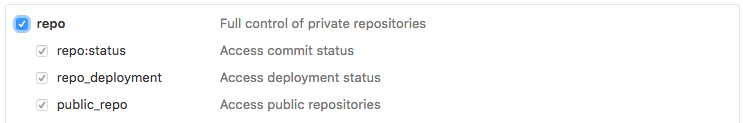

# node-github-diff

[](https://greenkeeper.io/)

> Github diffs with Node style 😎

[![MIT License][license-badge]][license]
[![PRs Welcome][prs-badge]][prs]
[![Watch on GitHub][github-watch-badge]][github-watch]
[![Star on GitHub][github-star-badge]][github-star]
[![Tweet][twitter-badge]][twitter]


A script to check the diffs between project versions.

## Usage

```js
const nodeGithubDiff = require('node-github-diff');

nodeGithubDiff({
  repository: 'willmendesneto/generator-update-yeoman-test',
  base: 'v0.0.3',
  head: 'v0.0.5',
})
.then((gitPatches) => console.log(gitPatches));
```


## Setup

### Private repositories

In order to use node-github-diff in private repositories you'll need to
[create a personal access token](https://github.com/settings/tokens)
which has permissions to read private repositories:



Then, set the environment variable `GITHUB_DIFF_TOKEN` to the token you've just created

You can run the following in the command line or add it your `.bashrc`, `.zshrc` or in your command line integration file

```bash
export GITHUB_DIFF_TOKEN=<token>
```

Or you can pass the github token information using in the options object, using  the `token` key.


```js
const nodeGithubDiff = require('node-github-diff');
...
nodeGithubDiff({
  repository: 'willmendesneto/generator-update-yeoman-test',
  base: 'v0.0.3',
  head: 'v0.0.5',
  token: 'your-github-token',
});
...
```

### Run node-github-diff

Make sure you have `npm@>=5.2.0`:

```
npm install -g npm@latest
```

This package is using `async/await` feature, so please make sure you are using `node@>=v7.6.0` which supports this feature by default based on [Node.green website](https://node.green/). In case you can't please make sure you're running the code with `--harmony-async-await` flag or using solving in your code.

### Parameters


## Usage

```js
const nodeGithubDiff = require('node-github-diff');

// Using promises
nodeGithubDiff({
  repository: 'willmendesneto/generator-update-yeoman-test',
  base: 'v0.0.3',
  head: 'v0.0.5',
})
.then((gitPatches) => console.log(gitPatches));

// using async/await
const gitPatches = await nodeGithubDiff(
  repository: 'willmendesneto/generator-update-yeoman-test',
  base: 'v0.0.3',
  head: 'v0.0.5',
);

console.log(gitPatches);
```


## Author

**Wilson Mendes (willmendesneto)**
+ <https://plus.google.com/+WilsonMendes>
+ <https://twitter.com/willmendesneto>
+ <http://github.com/willmendesneto>


[license-badge]: https://img.shields.io/badge/license-MIT%20License-blue.svg?style=flat-square
[license]: https://github.com/willmendesneto/nodebots-workshop/blob/master/LICENSE

[prs-badge]: https://img.shields.io/badge/PRs-welcome-brightgreen.svg?style=flat-square
[prs]: http://makeapullrequest.com

[github-watch-badge]: https://img.shields.io/github/watchers/willmendesneto/node-github-diff.svg?style=social
[github-watch]: https://github.com/willmendesneto/node-github-diff/watchers

[github-star-badge]: https://img.shields.io/github/stars/willmendesneto/node-github-diff.svg?style=social
[github-star]: https://github.com/willmendesneto/node-github-diff/stargazers

[twitter]: https://twitter.com/intent/tweet?text=Check%20out%20node-github-diff%20by%20@willmendesneto%20https://goo.gl/sqZ8dh%20%F0%9F%91%8D
[twitter-badge]: https://img.shields.io/twitter/url/https/github.com/willmendesneto/node-github-diff.svg?style=social
